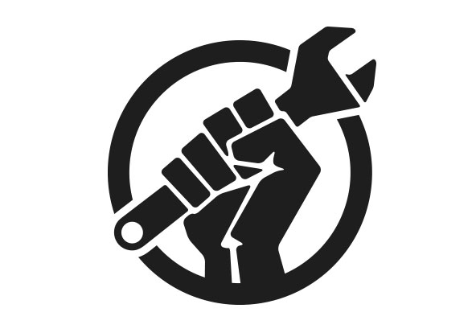

**Faça parte da comunidade e ajude o movimento a crescer no Brasil**

[Participe](./participe.md)

# O que é Direito de reparar?

Direito de reparar ou Direito ao reparo (do original Right to Repair), é um movimento global sobre garantir o direito do usuário a ter acesso a parte e ferramentas para consertar seus produtos, poder fazer o uso dos mesmos manuais e formas de diagnóstico de problemas que os fabricantes e acesso aos softwares para resetar peças e chaves de segurança.

* * *

# Porque você não pode consertar os seus produtos?

Você pode. 

No entanto, os produtos usados no dia-a-dia como eletrodomésticos, computadores e celulares estão se tornando cada vez mais difíceis de reparar. Muitas vezes algum equipamento tem um problema em uma única peça, o que poderia ser resolvido com a substituição mas as companhias não liberam acesso a compra dessa peça, ou para trocá-la é necessária uma ferramenta específica que apenas o fabricante tem e se faz necessário encontrar uma autorizada que pode acabar te cobrando muito mais por ser a única a fornecer esse serviço. 

Para além da restrição de acesso a peças e ferramentas muitos componentes eletrônicos de aparelhos são soldados ou colados de tal forma que não podem ser substituídos, como as baterias de celulares que são soldadas hoje em dia.

Quando não existem barreiras físicas, podem existir barreiras de software que fazem necessário o uso de um código específico para desbloquear a nova peça e torná-la compatível com o sistema do produto que você comprou para ser seu e ter direitos sobre isso.

Essas medidas fazem com que acabe sendo mais vantajoso e barato para o usuário comprar um novo produto, alimentando o crescente montante de lixo eletrônico global, e girando uma lógica sem sentido de forçar o consumidor a trocar todo um equipamento com centenas de componentes bons e funcionais por conta de um componente com defeito.

> **Você compraria um carro se não pudesse trocar os pneus?**
>
> **Então porque comprar um celular se você não pode trocar sua bateria?**

* * *

# Referências

## POR QUE você "não pode" CONSERTAR seu CELULAR?

Vídeo produzido pela Canaltech que aborda sobre o direito de reparar

[Canaltech](https://youtu.be/Z4ytOLJkMu4)

## Direito ao Conserto: o que é e por que lutar por ele

Artigo da ecycle sobre direito de consertar

[ecycle](https://www.ecycle.com.br/direito-ao-conserto/)

## Right to Repair EU

Site oficial da organização de direito de reparar da União Europeia

[Repair.eu](https://repair.eu/)

## Repair Estados Unidos

Site oficial da organização de direito de reparar dos Estados Unidos. 

[Repair US](https://www.repair.org/)

## I Fix It

iFixit é uma comunidade global composta por pessoas que se ajudam mutuamente em reparos. Vamos reparar o mundo, um dispositivo de cada vez.

[ifixit](https://pt.ifixit.com/)

<!--- * * *

* * *

 blllla 

# LEIA MAIS SOBRE:

## Segurança e sla o que dos produtos pelas empresas

[Segurança](./seguranca.html)

* * *

## O Lixo eletrônico ou E-Waste

[Lixo eletrônico](./ewaste.html) -->